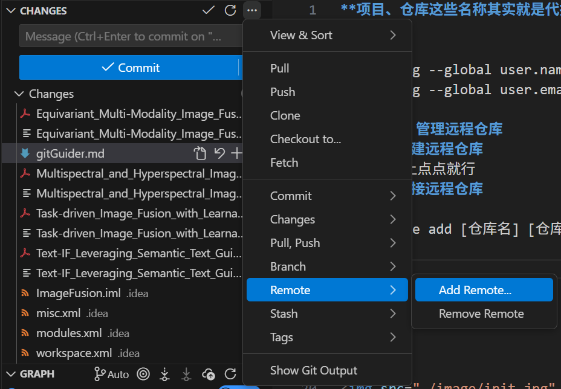
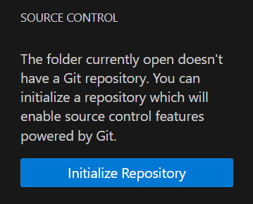
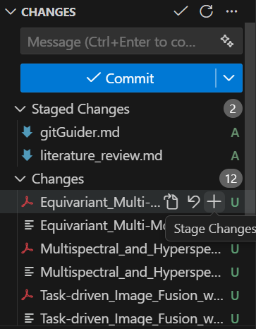
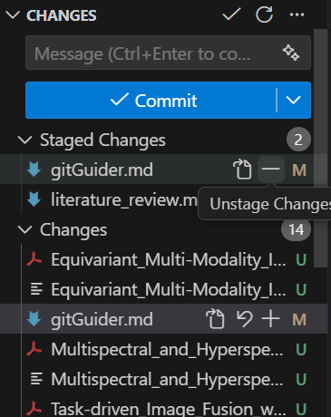
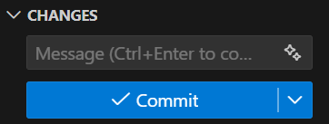
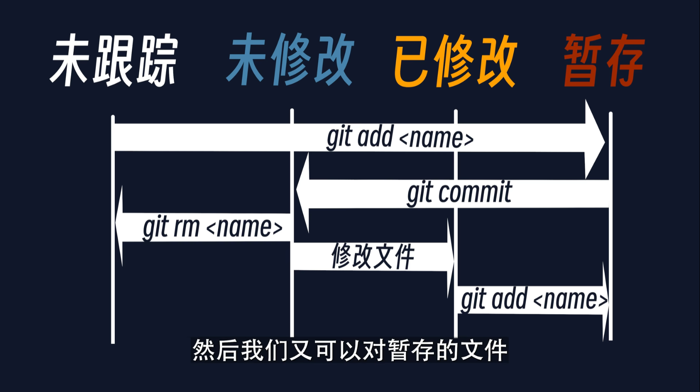

**项目、仓库这些名称其实就是代指文件夹！！！**
# 1.配置
```
git config --global user.name "用户名"
git config --global user.email github注册的邮箱 //不用双引号
```
# 2.新建、管理远程仓库
## 2.1.新建远程仓库
在github上点点就行
## 2.2.连接远程仓库
```
git remote add [仓库名] [仓库网址]
```
为该网址的远程仓库命名，方便后续识别  


## 2.3.删除远程仓库
```
git remote remove [仓库名]
```


## 2.4.查看远程仓库
```
git remote
git remote -v
```
# 3.新建本地仓库
```
git init
```
  

# 4.分支管理
## 4.1.创建分支
```
git branch [分支名]
```
## 4.2.切换分支
```
git branch
``` 
用于查看分支列表
```
git checkout [切换的分支名]
```
用于切换目标分支  
当前仓库副本中的**文件被修改且未提交**的情况下则**不允许切换分支**
## 4.3.合并分支
```
git merge [分支名]
```
将该分支合并到当前所在的分支上  
如果出现合并冲突，就打开冲突文件，然后将文件修改成想要的内容，然后执行`git add [冲突文件名]`和`git commit`
## 4.4.从远程仓库拉取分支
```
git fetch
```
## 4.5.跟踪远程分支
从远程仓库拉取分支后想将它变为本地分支
```
git checkout [本地分支名]
git checkout -b [本地分支名] [远程分支名]
git checkout --track [远程分支民]
```
三者选其一
# 5.克隆、更新本地仓库副本
## 5.1.克隆命令
```
git clone [http地址] [指定目录]
```
默认情况下，克隆的是远程仓库的主分支

```
git clone --branch [分支名] [http地址] [指定目录]
```
克隆指定分支的命令
## 5.2.更新操作
```
git pull
```
当远程仓库（GitHub）文件发生变化，可通过**更新操作更新本地仓库副本**  
更新本地仓库副本时，需要更新的文件本地也修改了则**发生更新冲突**从而失败（可以理解为本地文件和远程文件都和上个版本不一样时发生）
### 更新冲突解决方案
```
git stash // 暂存本地修改
git pull // 更新本地副本
git stash pop // 恢复本地更新
```
# 6.上传本地修改
## 第一步：提交文件到缓存区/跟踪文件
```
git status // 查看被修改的文件列表
git add [文件1] [文件2] // 提交文件到缓存区，文件名也能是文件夹
git add * // 提交全部文件到缓存区
git diff [文件] // 查看具体文件修改内容
```
- git对文件名的**大小写不敏感**  
- 跟踪就是纳入版本管理  
- 第一次用add对文件操作是对他跟踪，处于跟踪状态下并修改了该文件后，再次进行add操作是将它的修改内容写入缓存区  
- add操作对应于vscode里的＋号,"staged"就是被跟踪了  
  

对于不想跟踪或者提交的文件使用下面的命令删除
```
git rm [name]
```
对应vscode里的-号  
  
## 第二步：提交本地仓库
将暂存区的修改内容打包成一次更新,提交到本地仓库
```
git commit -m "更新日志"
```
在括号中输入日志

提交本地修改（提交用add操作过的文件），**不会同步到远程仓库**，只会记录在本地仓库副本的.git文件夹中  
可以通过下图了解文件状态  
  
## 第三步：提交远程仓库
```
git push [远程仓库名] [本地分支名]
```

- 将本地仓库的修改同步到远程仓库  
- 如果出现要输入账号密码的情况，输入github的账号和token（github>头像>Settings>Developer Settings>Personal access tokens>Tokens,记得勾选上repo）
- 上传远程仓库，要求本地仓库副本为远程仓库最新版本。如果发生了冲突，可能是本地修改的文件在远程仓库也被修改了，此时撤销本地提交（`git reset origin`），解决更新冲突（看上文更新部分），然后重新提交上传。

