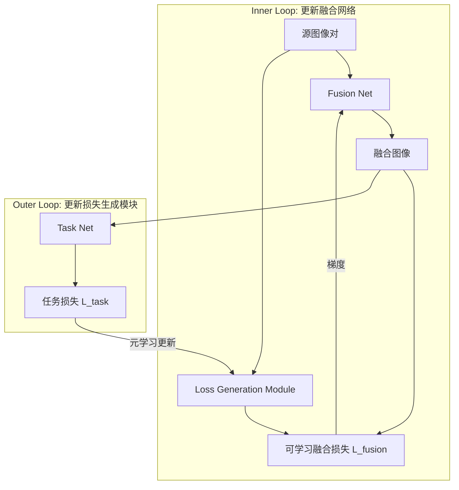
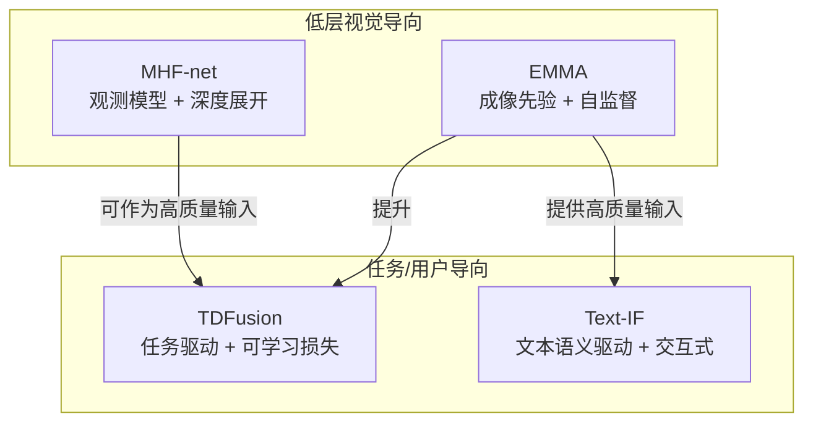

# 多模态图像融合方法综述与框架对比

本文对当前文件夹中的四篇多模态 / 多光谱图像融合论文的方法进行文献综述式梳理，并给出统一的框架化对比，从**监督信号来源、模型结构设计、先验与约束、可交互性 / 任务适配性**等维度归纳其特点。

- Equivariant Multi-Modality Image Fusion（EMMA，CVPR 2024）
- Multispectral and Hyperspectral Image Fusion by MS/HS Fusion Net（MHF-net，CVPR 2019）
- Task-driven Image Fusion with Learnable Fusion Loss（TDFusion，CVPR 2025）
- Text-IF: Leveraging Semantic Text Guidance for Degradation-Aware and Interactive Image Fusion（Text-IF，CVPR 2024）

---

## 一、整体方法对比与框架定位

### 1.1 核心思路对比概览

| 方法 | 任务场景 | 监督信号来源 | 模型类型 / 主体结构 | 关键先验或约束 | 交互 / 任务适配能力 |
| --- | --- | --- | --- | --- | --- |
| EMMA | 红外–可见、医学图像融合 | 无显式 GT，依赖自监督约束（成像等变 + 伪感知一致性） | U-Net + Restormer 卷积块的 U-Fuser + 伪感知模块 + 等变融合模块 | 等变成像先验、测量一致性、感知过程可学习建模 | 间接支持下游检测 / 分割，但不是显式任务驱动 |
| MHF-net | 多光谱–高光谱（MS/HS）融合，生成高分辨率 HS | 有合成对（HrMS, LrHS → HrHS）监督 | 模型驱动的深度展开网络，按观测模型与低秩先验设计迭代单元 | 观测模型 Y=XR, Z=CX + 低秩谱先验，基于近端梯度的优化结构 | 主要面向重建质量，非任务驱动、非交互式 |
| TDFusion | 通用多模态融合（红外–可见等），服务检测 / 分割等高层任务 | 完全依赖下游任务损失（任务驱动） | “融合模块 + 任务模块 + 可学习损失生成模块” 的元学习框架 | 可学习的融合损失（强度 + 梯度项权重由网络生成），双层优化 | 高度任务定制化，可适配不同下游任务与网络架构 |
| Text-IF | 退化感知 + 交互式红外–可见融合 | 基于图像重建 / 感知损失；语义文本仅作为条件指导 | Transformer 图像编码 + 跨模态语义交互指导模块 + 融合解码 | 文本–图像多模态对齐，统一退化处理与融合（all-in-one） | 通过文本提示实现退化感知与用户交互式、可定制融合 |

从整体上看，四篇工作可大致归入以下框架：

- **成像先验 / 自监督范式：** EMMA
- **模型驱动深度展开：** MHF-net
- **任务驱动 + 可学习损失：** TDFusion
- **文本语义驱动 + 退化感知 + 交互式：** Text-IF

### 1.2 统一框架图（方法族谱）

```mermaid
flowchart LR
    A[多模态输入\n(红外/可见/多光谱/高光谱)] --> B[融合框架选择]

    B --> B1[成像先验 / 自监督\nEMMA]
    B --> B2[模型驱动深度展开\nMHF-net]
    B --> B3[任务驱动 + 可学习损失\nTDFusion]
    B --> B4[文本语义驱动 + 退化感知\nText-IF]

    B1 --> C1[显式建模\n感知过程 + 等变约束]
    B2 --> C2[显式观测模型 + 低秩先验\n→ 深度展开网络]
    B3 --> C3[下游任务网络提供梯度\n元学习可学习融合损失]
    B4 --> C4[文本语义编码 + 交互式控制\n统一退化处理与融合]

    C1 --> D[高质量融合结果\n提升下游检测/分割]
    C2 --> D
    C3 --> D
    C4 --> D
```

---

## 二、EMMA：等变成像驱动的自监督多模态融合框架

### 2.1 方法核心思想

- **问题背景：** 多模态融合没有真实“理想融合图像”作为 GT，只能观测到不同传感器下的源图像（如红外 i、可见 v），本质上是一个**非线性、盲逆问题**。
- **核心假设：**
  - 存在一个信息丰富的融合图像 \(f\)，源图像由此通过不同感知过程得到：  
    \[
    f = F(i, v) + n_f,\quad i = A_i(f) + n_i,\quad v = A_v(f) + n_v
    \]
  - **测量一致性（measurement consistency）：**  
    \[
    A_i(F(i, v)) \approx i,\quad A_v(F(i, v)) \approx v
    \]
  - **等变成像先验：** 自然图像集合对平移、旋转、翻转等变换近似不变，成像系统整体应对这些变换保持等变：
    \[
    F(A_i(T_g f), A_v(T_g f)) = T_g F(A_i(f), A_v(f))
    \]
- **自监督范式：** 通过**可学习的伪感知模型 + 等变约束**，在无真实融合 GT 情况下学习融合网络。

### 2.2 框架图与模块划分

```mermaid
flowchart LR
    I[红外图 i] --- Fm[U-Fuser\n(融合模块)]
    V[可见图 v] --- Fm
    Fm --> F[f 融合图像]

    F --> A1[伪感知模块 A_i\n(UNet结构)]
    F --> A2[伪感知模块 A_v\n(UNet结构)]
    A1 --> I_hat[重建红外 î]
    A2 --> V_hat[重建可见 ṽ]

    F --> T[T_g 变换\n(平移/旋转/翻转)]
    T --> F_t[T_g(f)]
    F_t --> A1t[A_i(T_g(f))]
    F_t --> A2t[A_v(T_g(f))]
    A1t --> Fm2[等变融合模块\n共享 U-Fuser]
    A2t --> Fm2
    Fm2 --> F_eq[等变约束输出]
```

### 2.3 损失设计与训练方式

- **感知一致性损失（sensing loss）：**
  - 保证伪感知模块输出与真实源图一致：
    \[
    \mathcal{L}_\text{sense} = \|A_i(f) - i\| + \|A_v(f) - v\|
    \]
- **等变约束损失（equivariant loss）：**
  - 约束“先变换后成像融合”和“先成像融合后变换”一致：
    \[
    \mathcal{L}_\text{eq} = \|F(A_i(T_g f), A_v(T_g f)) - T_g F(A_i(f), A_v(f))\|
    \]
- **整体训练：**
  - 以 U-Fuser、伪感知模块、等变模块为端到端可训练网络，在**完全自监督**框架下优化。

### 2.4 方法特点与定位

- 优点：
  - 解决“无 GT”场景下多模态融合训练难题；
  - 将**成像物理先验（等变性 + 感知过程）显式注入网络**；
  - 对红外–可见、医学等多任务具有一定泛化性。
- 局限：
  - 主要面向低层视觉质量，任务适配是“间接”的；
  - 等变约束对几何变换建模较强，可能增加训练复杂度。

---

## 三、MHF-net：模型驱动的深度展开 MS/HS 融合

### 3.1 观测模型与先验

- **观测模型：**
  - 目标：高分辨率高光谱图像 \(X \in \mathbb{R}^{HW \times S}\)；
  - 高分辨率多光谱（HrMS）图像 \(Y \in \mathbb{R}^{HW \times s}\)：
    \[
    Y = XR + N_y
    \]
  - 低分辨率高光谱（LrHS）图像 \(Z \in \mathbb{R}^{hw \times S}\)：
    \[
    Z = CX + N_z
    \]
  - 其中 \(R\) 为光谱响应矩阵，\(C\) 为下采样 + 模糊算子。
- **谱低秩先验：**
  - 假设 \(X\) 在谱维度近似低秩，可被 HrMS 图像 Y 与待估计基 \(\hat{Y}\) 线性表示：
    \[
    X \approx YA + \hat{Y}B
    \]

### 3.2 模型与迭代优化

- 构建联合模型：同时考虑观测方程 (1)(2) 与低秩谱展开，将 MS/HS 融合写成一个带有数据保真项与先验项的优化问题；
- 采用**近端梯度方法（proximal gradient）**设计求解算法；
- 将迭代求解过程中的每一步（梯度下降 + 近端算子）**展开为一层网络**，从而构成 MHF-net。

### 3.3 框架图（深度展开结构）

```mermaid
flowchart LR
    Y[HrMS 图像 Y] --> In1
    Z[LrHS 图像 Z] --> In1

    subgraph Unfolded Iterations
        In1 --> S1[迭代单元 1\n(梯度步 + 近端映射)]
        S1 --> S2[迭代单元 2]
        S2 --> S3[...]
        S3 --> Sk[迭代单元 K]
    end

    Sk --> X_hat[HrHS 估计 X^]
```

在每个迭代单元中：

- 显式使用观测算子（或其可学习版本）模拟 \(R, C\)；
- 使用 CNN 模块学习近端算子，实现对谱低秩结构及空间先验的建模。

### 3.4 训练与特点

- **训练方式：**
  - 利用模拟/真实数据构造的 (Y, Z, X) 成对样本；
  - 端到端训练整个展开网络，学习近端算子与相关参数。
- **特点：**
  - **模型驱动 + 数据驱动**的深度展开框架，物理意义清晰；
  - 针对 MS/HS 融合场景的结构化设计，充分利用观测模型；
  - 但主要面向重建精度，不涉及任务驱动或交互式控制。

---

## 四、TDFusion：任务驱动与可学习融合损失

### 4.1 问题与动机

- 现有“任务级融合”通常做法：
  - 将融合网络与下游任务网络级联，用任务损失（检测、分割等）约束融合；
  - 但**融合损失仍采用固定、人工设计的项**（如强度保持、梯度保持），缺乏对任务需求的自适应。
- 问题：
  - 固定的融合损失可能与具体任务不匹配；
  - 各任务对“保留何种信息”的偏好不同（例如检测偏重目标亮度，分割偏重边界与结构）。

### 4.2 框架组成

TDFusion 提出一个**任务驱动的元学习框架**，包含三个关键模块：

1. **融合模块（Fusion Net）：**
   - 任意结构的多模态融合网络，输入多模态图像，输出融合结果。
2. **任务模块（Task Net）：**
   - 下游任务网络（如语义分割 / 目标检测），在训练中固定或预训练；
   - 对融合图像输出任务预测，并计算任务损失 \(L_\text{task}\)。
3. **损失生成模块（Loss Generation Module）：**
   - 一个神经网络，根据当前源图像及特征，生成**融合损失的权重/参数**；
   - 用于构造一个**可学习的融合损失 \(L_\text{fusion}\)**，通常形式包含强度与梯度保持等项：
     \[
     L_\text{fusion} = \alpha(x)\,L_\text{intensity} + \beta(x)\,L_\text{gradient} + \dots
     \]
     其中 \(\alpha(x), \beta(x)\) 由损失生成模块输出。

### 4.3 元学习训练机制（双层优化）



- **内层（inner update）：**
  - 冻结损失生成模块；
  - 使用当前的可学习融合损失 \(L_\text{fusion}\) 更新融合网络参数，使融合结果在该损失下更优。
- **外层（outer update）：**
  - 将内层更新后的融合网络与任务网络级联，计算任务损失 \(L_\text{task}\)；
  - 用 \(L_\text{task}\) 对损失生成模块进行反向传播更新，使得其生成的 \(L_\text{fusion}\) 更有助于降低任务损失。

### 4.4 方法特点与定位

- 优点：
  - 将“如何设计融合损失”**交给网络学习**，而不是人工固定；
  - 训练完全依赖任务损失，可适配**任意任务网络与任务类型**；
  - 从元学习角度理解，损失生成模块类似“学习任务相关超参数 / 损失形状”。
- 局限：
  - 训练过程复杂，涉及双层优化，计算开销较大；
  - 对下游标注依赖强，适用于**任务为核心**的融合应用场景。

---

## 五、Text-IF：文本语义指导的退化感知与交互式融合

### 5.1 问题设定与动机

- 实际红外–可见图像往往存在多种退化：
  - 可见图像：低照度、过曝、模糊、噪声等；
  - 红外图像：噪声、低对比度等。
- 传统方案：
  - 先使用多个专门的图像复原模型对不同退化分别处理，再进行融合；
  - 既缺乏统一性，也难以根据用户主观需求交互式调整。
- Text-IF 目标：
  - 通过**文本语义提示**，在一个统一模型中同时处理退化和融合；
  - 提供**交互式、可定制**的融合结果。

### 5.2 整体架构

Text-IF 是一个**图像–文本多模态联合框架**，关键模块包括：

1. **图像管线（Image Pipeline）：**
   - Transformer-based 图像特征提取器，分别对红外和可见图像进行编码；
   - 设计跨尺度 / 跨模态的 cross-fusion 层，对多模态特征进行融合；
   - 在特征层面同时完成“退化处理 + 信息融合”。
2. **文本语义编码器（Text Semantic Encoder）：**
   - 基于大规模预训练视觉–语言模型（如 CLIP）的文本编码器；
   - 输入用户文本提示，如“增强夜间行人”、“削弱噪声、突出目标轮廓”等；
   - 输出高维文本语义向量。
3. **语义交互指导模块（Semantic Interaction Guidance）：**
   - 将文本语义与图像融合特征进行对齐与交互（如通过 cross-attention 或条件调制）；
   - 使得融合过程在特征层上**遵循文本提示的偏好**（例如更重视亮度、边缘、某类目标等）。

### 5.3 框架图（文本指导的 all-in-one 融合）

```mermaid
flowchart LR
    IV[红外图] --> IE[图像编码器\n(Transformer)]
    VI[可见图] --> IE
    IE --> IF[多尺度跨模态\n特征融合层]

    Txt[文本提示\n(描述退化与偏好)] --> TE[文本语义编码器\n(预训练VL模型)]
    TE --> SG[语义交互指导模块]
    IF --> SG

    SG --> Dec[融合解码器]
    Dec --> Fused[退化感知 + 交互式\n融合图像]
```

### 5.4 训练与特点

- **训练信号：**
  - 使用融合质量相关的重建 / 感知损失，度量融合结果与期望特性之间的差异；
  - 文本语义作为条件，不直接提供标签，而是改变损失优化的“偏好方向”。
- **方法优势：**
  - **多模态信息融合：** 不仅融合“图像–图像”，也融合“文本–图像”信息；
  - **退化感知：** 文本可描述退化类型，模型在特征层面联合完成增强与融合；
  - **交互式与可定制：** 用户可通过文本调节融合结果，无需重新训练模型。
- 局限：
  - 对预训练文本–图像模型依赖较强；
  - 需要精心设计训练策略，避免文本提示与图像内容不匹配时的偏差。

---

## 六、综合分析与文献综述视角总结

从文献综述的角度，四篇工作在方法论上呈现出多模态融合研究的几条重要发展路径：

1. **从“静态损失 + 经验先验”向“可学习先验 / 损失”演进：**
   - MHF-net 通过模型驱动 + 低秩先验提升可解释性；
   - EMMA 进一步把**等变成像先验**融入自监督框架；
   - TDFusion 则把“损失本身”作为可学习对象，用元学习让下游任务决定融合损失的形态。

2. **从“仅图像模态”走向“多模态信息（图像 + 文本）”：**
   - EMMA / MHF-net / TDFusion 主要在图像域建模；
   - Text-IF 迈向文本–图像联合建模，借助预训练多模态模型实现**语义级引导**与交互。

3. **从“重建导向”走向“任务导向 + 交互导向”：**
   - MHF-net、EMMA 主要关注融合质量与对下游任务的间接促进；
   - TDFusion 直接以下游任务损失为唯一训练信号，实现真正的**任务驱动融合**；
   - Text-IF 则从用户交互角度出发，通过文本提示实现**主观需求驱动的可定制融合**。

4. **统一视角下的框架归类：**



在实际研究与工程应用中，可以根据目标需求进行组合与扩展：

- 若缺乏 GT、强调物理合理性：优先考虑 EMMA 这类**自监督 + 成像先验**方法；
- 若有明确观测模型、关注可解释性与重建质量：采用 MHF-net 类型的**模型驱动深度展开**；
- 若关注下游检测 / 分割等任务性能：使用 TDFusion 框架，将现有融合网络升级为**任务驱动版本**；
- 若需要应对复杂退化并提供用户交互：可以以 Text-IF 为代表，引入**文本语义指导与多模态交互机制**。

---

以上内容可作为这四篇论文在“方法与框架”层面的综述性总结，并为后续撰写更长篇幅的文献综述或设计新方法提供参考。若需要，我可以进一步根据你的具体研究方向（如红外–可见、医学、多光谱–高光谱或高层任务场景）再定制一个更针对性的“方法谱系 + 研究空白”分析。 

